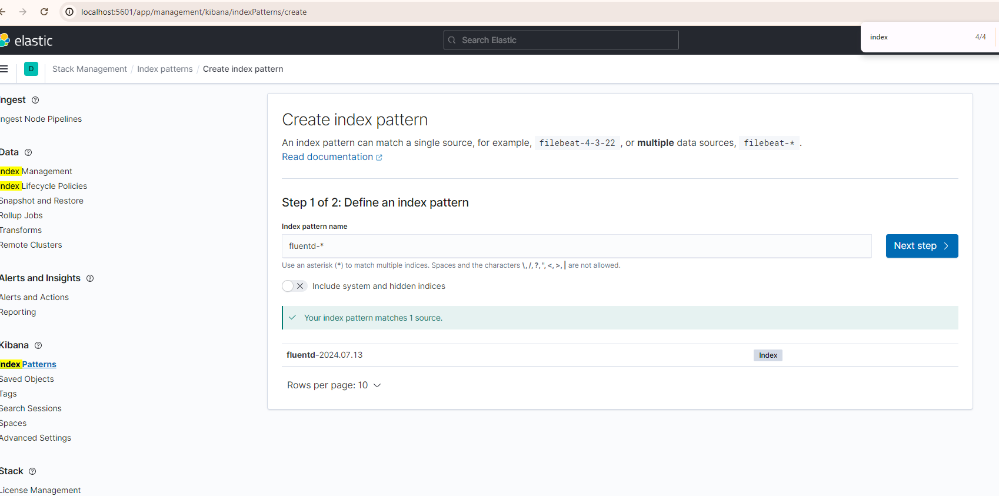
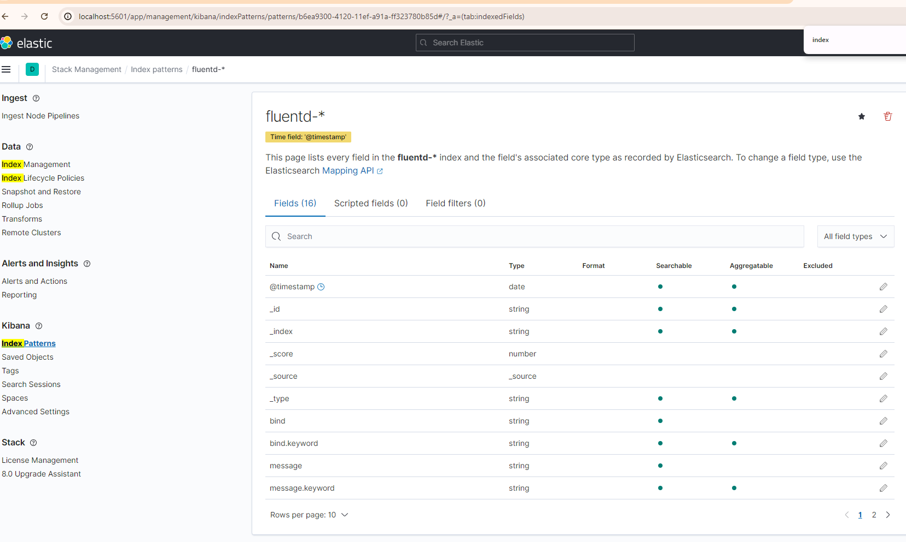

# Flask Pokemon App

This repository contains the source code and infrastructure configuration for the Flask Pokemon App, a simple web application that interacts with the PokeAPI to fetch Pokemon data.

## Project Structure

- `app.py`: The main Flask application.
- `Dockerfile`: Docker configuration for building the application image.
- `k8s/`: Kubernetes configuration files.
  - `configmap.yaml`: Configuration map for the application.
  - `server-deployment.yaml`: Deployment configuration for the application.
  - `server-service.yaml`: Service configuration for the application.
  - `hpa.yaml`: Horizontal Pod Autoscaler configuration.
  - `grafana-deployment.yaml`: Deployment configuration for Grafana.
- `infra/`: Terraform configuration files.
  - `main.tf`: Main Terraform configuration file.
  - `variables.tf`: Terraform variables file.
  - `outputs.tf`: Terraform outputs file.
- `controllers/`: Contains the application controllers.
  - `pokemon_controller.py`: Controller for handling Pokemon-related routes.
- `services/`: Contains the application services.
  - `pokemon_service.py`: Service for interacting with the PokeAPI.
- `utils/`: Utility functions for logging, metrics, and tracing.
  - `logging.py`
  - `metrics.py`
  - `tracing.py`
- `img.png`: Diagram of the monitoring setup.
- `img_1.png`: Screenshot of the Kibana dashboard.

## How to Run the Project

### Prerequisites

- Docker
- Kubernetes
- Terraform
- Google Cloud Platform (GCP) account
- GitHub account

### Steps to Run

1. **Clone the repository:**
   ```sh
   git clone https://github.com/segalzeyalz/flask-pokemon-app.git
   cd flask-pokemon-app

2. **Build and run the Docker container locally:**
   ```sh
   docker build -t flask-pokemon-app:latest .
   docker run -p 5000:5000 flask-pokemon-app:latest
3. **Access the application:**
      Open a web browser and navigate to `http://localhost:5000`.

## Deployment with K8S
1. Apply the Kubernetes configuration files:
   ```sh
   kubectl apply -f k8s/
2. verify the deployment:
   ```sh
   kubectl get pods
   kubectl get services
   kubectl get hpa

** Monitoring and Logging **
1. **Access the Grafana dashboard:**
   ```sh
   kubectl port-forward svc/grafana 3000:3000
   Open a web browser and navigate to `http://localhost:3000`.
   Use the following credentials to log in:
   - Username: admin
   - Password: admin
2. **Access the Kibana dashboard:**
   ```sh 
   kubectl port-forward svc/kibana 5601:5601
   
to see logs need to define the fluentd there,
for that do as in the following screens:


 
3. **Access the Prometheus dashboard:**
   ```sh
   kubectl port-forward svc/prometheus 9090:9090
